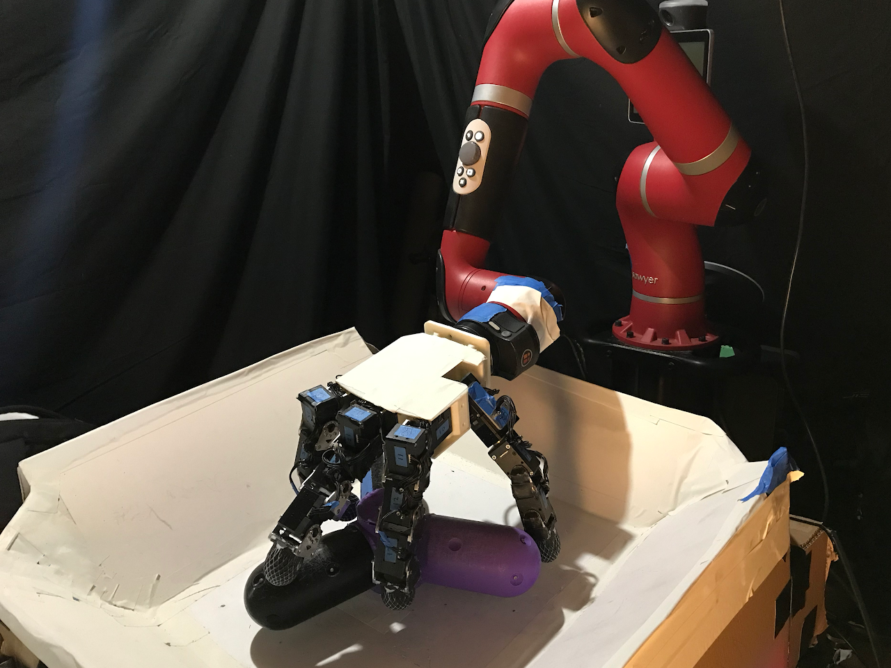

    

        Reset-Free Reinforcement Learning via Multi-Task Learning:
        Learning Dexterous Manipulation Behaviors without Human Intervention
    

    

        Abhishek Gupta*, Justin Yu*, Tony Z. Zhao*, Vikash Kumar*,  Aaron Rovinsky, Kelvin Xu, Thomas Devlin, Sergey Levine
    

    

        International Conference on Robotics and Automation (ICRA) 2021
    

    

        <a role="button" class="btn btn-secondary font-weight-bold text-light mt-2 py-1 px-2" style="font-size: 14px;" href="https://arxiv.org/abs/2004.12570">ARXIV</a>
        <a role="button" class="btn btn-secondary font-weight-bold text-light mt-2 py-1 px-2" style="font-size: 14px;" href="https://sites.google.com/view/mtrf/">WEBSITE</a>
       <a role="button" class="btn btn-secondary font-weight-bold text-light mt-2 py-1 px-2" style="font-size: 14px;" href="https://youtu.be/64FLPhvqgrw">TALK</a>
    

    

    
The Ingredients of Real-World Robotic Reinforcement Learning

    

        Henry Zhu*, Justin Yu*, Abhishek Gupta, Dhruv Shah, Kristian Hartikainen, Avi Singh, Vikash Kumar, Sergey Levine
    

    

        International Conference on Learning Representations (ICLR) 2020
        (Spotlight Presentation)
    

    

        <a role="button" class="btn btn-secondary font-weight-bold text-light mt-2 py-1 px-2" style="font-size: 14px;" href="https://arxiv.org/abs/2004.12570">ARXIV</a>
        <a role="button" class="btn btn-secondary font-weight-bold text-light mt-2 py-1 px-2" style="font-size: 14px;" href="https://sites.google.com/view/realworld-rl/">WEBSITE</a>
        <a role="button" class="btn btn-secondary font-weight-bold text-light mt-2 py-1 px-2" style="font-size: 14px;" href="https://bair.berkeley.edu/blog/2020/04/27/ingredients/">BLOG</a>
        <a role="button" class="btn btn-secondary font-weight-bold text-light mt-2 py-1 px-2" style="font-size: 14px;" href="https://www.youtube.com/watch?v=LR6OyQdhEdQ">TALK</a>
    

    

